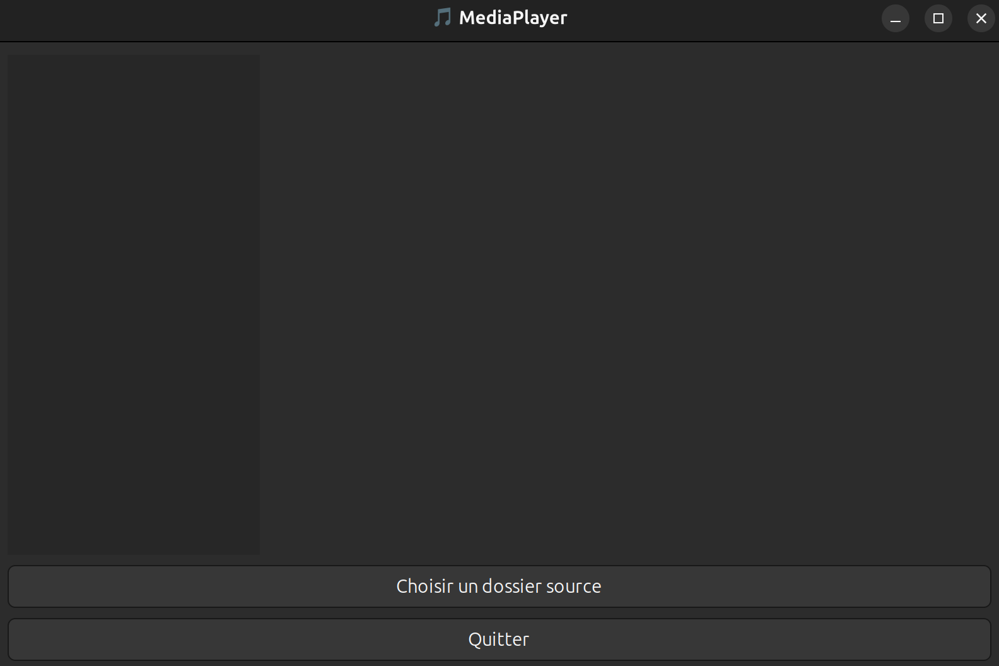
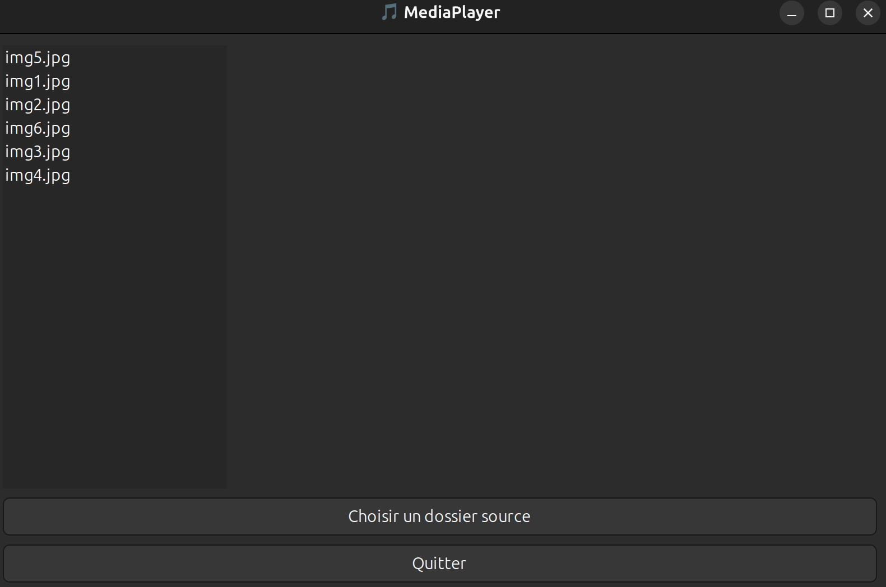
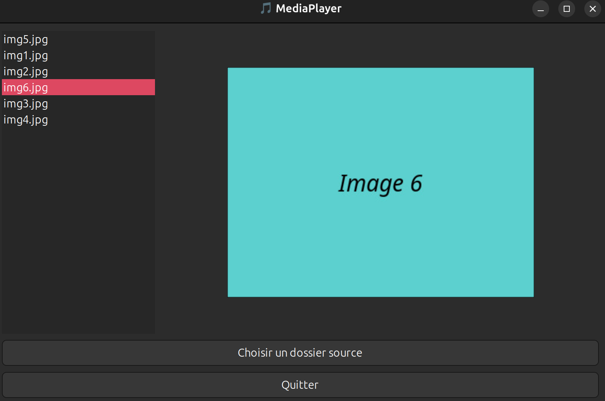

# Sécurite - Virologie

## Projet de création d'un virus de type compagnon

## Introduction

Ce projet a pour but la réalisation d'un virus compagnon en C sous Linux, dénommé MediaPlayer, qui s'infiltre dans un
répertoire source contenant des fichiers exécutables et les "infecte" de manière transparente, tout en rendant un
service apparent à l'utilisateur : afficher des images via une interface graphique GTK.

Le programme MediaPlayer est conçu pour tromper l'utilisateur en apparaissant comme un logiciel bénéfique (lecteur
d'image), mais effectue en réalité une infection silencieuse des exécutables présents dans un répertoire cible.

Ce rapport détaille les étapes de la conception, les choix techniques, l'organisation du projet, et fournit des réponses
explicites aux questions posées dans le sujet.

## Objectif

Dans ce projet, nous concevrons pas à pas un virus de type compagnon (Vu en TD)

1. __Le contexte :__

On vous fournit un cd ROM rempli d'image et de vidéos accompagné d'un programme s'intitulant MediaPlayer.exe (le virus)
censé n'afficher qu'une image/ ou procéder à la lecture d'une vidéo (mais en réalité plus que cela ...).

Ici, la proximité d'un "Player" à côté de multiples images (ou vidéos) qui permet de susciter le click de l'utilisateur
et donc la diffusion.

## Travail demandé

1. Vous devez concevoir un programme virus de type compagnon en langage C.
2. Il sera écrit avec l'éditeur de texte de votre choix.
3. Il portera le nom de MediaPlayer.exe et sera compilé
   avec [gcc](https://fr.wikipedia.org/wiki/GNU_Compiler_Collection).
4. Il vous est conseillé de développer graduellement, fonction par fonction, et de visualiser point par point les
   retours de votre programme.

## Développement

### Environnement de développement

- Utilisation de l'IDE [CLion](https://www.jetbrains.com/fr-fr/clion/) pour le développement
- Utilisation de [gcc](https://fr.wikipedia.org/wiki/GNU_Compiler_Collection) pour la compilation
- Utilisation de [CMake](https://fr.wikipedia.org/wiki/CMake) pour la gestion des dépendances

### Structure du projet

```
.
├── build
├── sandbox
├── CMakeLists.txt
├── detection.c
├── detection.h
├── infection.c
├── infection.h
├── init.sh
├── mediaplayer.c
├── mediaplayer.h
├── README.md
├── scanner.c
├── scanner.h
├── transfert.c
└── transfert.h
```

- [build](./build) : Dossier de compilation
- [sandbox](./sandbox) : Dossier de test
- [CMakeLists.txt](./CMakeLists.txt) : Fichier de configuration de CMake
- [detection.c](./detection.c) : Fichier source de la détection -> Fonctions de détection de l'infection
- [detection.h](./detection.h) : Fichier d'en-tête de la détection
- [infection.c](./infection.c) : Fichier source de l'infection -> Fonctions d'infection des fichiers
- [infection.h](./infection.h) : Fichier d'en-tête de l'infection
- [init.sh](./init.sh) : Script d'initialisation de la sandbox
- [mediaplayer.c](./mediaplayer.c) : Fichier source du virus
- [mediaplayer.h](./mediaplayer.h) : Fichier d'en-tête du virus
- [README.md](./README.md) : Fichier README
- [scanner.c](./scanner.c) : Fichier source du scanner -> Fonctions de scan des fichiers
- [scanner.h](./scanner.h) : Fichier d'en-tête du scanner
- [transfert.c](./transfert.c) : Fichier source du transfert -> Fonctions de transfert de l'exécution du virus
- [transfert.h](./transfert.h) : Fichier d'en-tête du transfert

### Compilation

Ne pas oublier d'installer les dépendances avant de compiler le projet :

```bash
sudo apt install libgtk-3-dev
sudo apt install imagemagick
```

```bash
cd build
cmake ..
make
```

### Utilisation

Une fois le projet compilé, vous pouvez exécuter le virus avec la commande suivante :

```bash
cd ..
./init.sh
cd build
./MediaPlayer.exe
```

Ce script initialise un dossier de test [sandbox](./sandbox) avec des fichiers de test ainsi que des images, puis la
commande `./MediaPlayer.exe` exécute lance l'application, l'utilisateur devra choisir un dossier source (tout les
programme de ce dossier et de ses sous-dossiers seront infectés). Le programme récupérera toutes les images et vidéos
dans un menu à gauche et l'utilisateur pourra les visionner en cliquant dessus.

### Bibliothèques utilisées

- [stdio.h](https://en.wikipedia.org/wiki/Stdio.h) : Pour les entrées/sorties
- [stdlib.h](https://en.wikipedia.org/wiki/Stdlib.h) : Pour les fonctions de conversion de chaînes, de gestion de la
  mémoire, de recherche, de tri et d'autres fonctions
- [string.h](https://en.wikipedia.org/wiki/String.h) : Pour les fonctions de manipulation de chaînes
- [sys/stat.h](https://en.wikipedia.org/wiki/Sys/stat.h) : Pour les fonctions de manipulation de fichiers
- [unistd.h](https://en.wikipedia.org/wiki/Unistd.h) : Pour les fonctions de gestion des fichiers et des répertoires
- [dirent.h](https://en.wikipedia.org/wiki/Dirent.h) : Pour les fonctions de manipulation de répertoires
- [errno.h](https://en.wikipedia.org/wiki/Errno.h) : Pour les fonctions de gestion des erreurs
- [time.h](https://en.wikipedia.org/wiki/Time.h) : Pour les fonctions de gestion du temps
- [gtk/gtk.h](https://en.wikipedia.org/wiki/GTK) : Pour les fonctions de gestion de l'interface graphique
- [pthread.h](https://en.wikipedia.org/wiki/POSIX_Threads) : Pour les fonctions de gestion des threads
- [limits.h](https://en.wikipedia.org/wiki/Limits.h) : Pour les constantes de limites

---

## Fonctionnement Global

### Primo-infection

- L'utilisateur lance l'exécutable MediaPlayer.exe
- Une fenêtre GTK s'ouvre avec la liste des images et une interface de choix de dossier
- Lorsque l'utilisateur choisit un dossier, l'infection commence en arrière-plan
- Tous les fichiers exécutables non infectés du dossier et des sous-dossiers du dossier source sont copiés sous forme
  `<nom>.old`
- Chaque action est enregistrée dans `log.txt`

### Infection secondaire

- L'utilisateur exécute un fichier infecté
- Le virus transfère automatiquement l'exécution vers le `<nom>.old` original via `execv`
- Le programme original fonctionne normalement, la charge virale est indétectable

---

## Développement et implantation technique

### Infection - [infection.c](./infection.c)

- Utilisation de `rename()`, `system("cp ...")` et `chmod()` pour renommer, copier et changer les permissions
- L'infection est récursive dans tous les sous-dossiers
- Elle est exécutée dans un thread `POSIX (pthread)` afin de ne pas bloquer le GUI

### Interface graphique - [GTK](https://en.wikipedia.org/wiki/GTK)

- Interface avec `GtkWindow`, `GtkBox`, `GtkListBox`, `GtkImage`
- Choix d'un dossier via `GtkFileChooserDialog`
- Affichage des images dans la fenêtre
- Interaction dynamique (clic = affichage)

### Scanner / Détection - [scanner.c](./scanner.c) / [detection.c](./detection.c)

- [scanner.c](./scanner.c) utilise `stat()` et `access()` pour filtrer les fichiers exécutables
- [detection.c](./detection.c) vérifie si un fichier est déjà infecté (présence d'un `.old`)

### Transfert - [transfert.c](./transfert.c)

- Si l’exécutable n’est pas `MediaPlayer`, transfert vers `<nom>.old` via `execv()`

### Tracing

- Format : date, heure, fichier, état (OK, erreur, ignoré)
- Exemple :

```bash
[2025-03-29 00:26:16] Analyse de : ./sandbox/MonPG1
   └─ [OK] Infection réussie
```

---

## Questions du sujet

1. Le programme infecte-t-il bien tous les fichiers exécutables ?
   - Oui, grâce à une exploration récursive de l'arborescence (sous-dossiers inclus), et à la vérification
     `est_executable_regulier()`.
2. Comment reconnaît-il qu'un fichier est déjà infecté ?
   - Il teste la présence d’un fichier `<nom>.old` avec `access()` et vérifie son statut avec `stat()`.
3. Les fichiers infectés fonctionnent-ils comme avant ?
   - Oui, car l’ancien fichier est renommé, et l’appel à `execv()` dans le faux binaire relance le programme original
     de façon transparente.
4. Le programme rend-il un service utile ?
   - Oui : il simule un lecteur d’images moderne avec une interface graphique, affichage inline, navigation, et
     interaction utilisateur.
5. L'infection est-elle détectable facilement ?
   - Non, car aucun message d’erreur, aucun comportement suspect n’est visible. Le fichier `.old` reste dans le même
     dossier, non exécuté sauf par transfert automatique.
6. Des fichiers sont-ils modifiés ou perdus ?
   - Aucun fichier exécutable n’est supprimé. Le programme original est sauvegardé sous `.old` et exécuté normalement.
     Aucun fichier image n’est touché.
7. Peut-on tracer l’infection ?
   - Oui, un fichier `log.txt` est créé dans le dossier source, enregistrant chaque infection avec date, heure et
     statut.

---

## Conclusion

Ce projet a permis de comprendre le fonctionnement des virus compagnons, la manipulation de fichiers binaires, et
l’intégration d’une interface graphique GTK en C. Il illustre comment une charge virale peut être dissimulée sous un
comportement utile, et démontre la nécessité de surveiller les comportements inattendus dans des binaires même "
fonctionnels".

Tous les objectifs ont été remplis : infection silencieuse, conservation de la fonctionnalité originale, exécution
transparente, et rendu utile.

---

## Annexes

### Extraits du fichier log.txt

```bash
[2025-03-29 00:38:16] Analyse de : /home/armotik/Documents/Université/L3/S6/Sécurité/virus/sandbox/MonPG5
[2025-03-29 00:38:16]    └─ [OK] Infection réussie : /home/armotik/Documents/Université/L3/S6/Sécurité/virus/sandbox/MonPG5
[2025-03-29 00:38:16] Analyse de : /home/armotik/Documents/Université/L3/S6/Sécurité/virus/sandbox/MonPG3
[2025-03-29 00:38:16]    └─ [OK] Infection réussie : /home/armotik/Documents/Université/L3/S6/Sécurité/virus/sandbox/MonPG3
[2025-03-29 00:38:16] Analyse de : /home/armotik/Documents/Université/L3/S6/Sécurité/virus/sandbox/MonPG4
[2025-03-29 00:38:16]    └─ [OK] Infection réussie : /home/armotik/Documents/Université/L3/S6/Sécurité/virus/sandbox/MonPG4
[2025-03-29 00:38:16] Analyse de : /home/armotik/Documents/Université/L3/S6/Sécurité/virus/sandbox/MonPG2
[2025-03-29 00:38:16]    └─ [OK] Infection réussie : /home/armotik/Documents/Université/L3/S6/Sécurité/virus/sandbox/MonPG2
[2025-03-29 00:38:16] Analyse de : /home/armotik/Documents/Université/L3/S6/Sécurité/virus/sandbox/MonPG1
[2025-03-29 00:38:16]    └─ [OK] Infection réussie : /home/armotik/Documents/Université/L3/S6/Sécurité/virus/sandbox/MonPG1
[2025-03-29 00:41:26] Analyse de : /home/armotik/Documents/Université/L3/S6/Sécurité/virus/sandbox/MonPG5
[2025-03-29 00:41:26]    └─ [OK] Infection réussie : /home/armotik/Documents/Université/L3/S6/Sécurité/virus/sandbox/MonPG5
[2025-03-29 00:41:26] Analyse de : /home/armotik/Documents/Université/L3/S6/Sécurité/virus/sandbox/MonPG3
[2025-03-29 00:41:26]    └─ [OK] Infection réussie : /home/armotik/Documents/Université/L3/S6/Sécurité/virus/sandbox/MonPG3
[2025-03-29 00:41:26] Analyse de : /home/armotik/Documents/Université/L3/S6/Sécurité/virus/sandbox/MonPG4
[2025-03-29 00:41:26]    └─ [OK] Infection réussie : /home/armotik/Documents/Université/L3/S6/Sécurité/virus/sandbox/MonPG4
[2025-03-29 00:41:26] Analyse de : /home/armotik/Documents/Université/L3/S6/Sécurité/virus/sandbox/MonPG2
[2025-03-29 00:41:26]    └─ [OK] Infection réussie : /home/armotik/Documents/Université/L3/S6/Sécurité/virus/sandbox/MonPG2
[2025-03-29 00:41:26] Analyse de : /home/armotik/Documents/Université/L3/S6/Sécurité/virus/sandbox/MonPG1
[2025-03-29 00:41:26]    └─ [OK] Infection réussie : /home/armotik/Documents/Université/L3/S6/Sécurité/virus/sandbox/MonPG1
```

### Le fichier init.sh

```bash
#!/bin/bash

# Dossier de travail
SANDBOX="./sandbox"
IMGDIR="$SANDBOX"

echo "[*] Initialisation de l'environnement de test dans $SANDBOX..."

# Réinitialisation
rm -rf "$SANDBOX"
mkdir -p "$IMGDIR"
cd "$SANDBOX" || exit 1

# Création de vraies images avec ImageMagick
echo "[*] Génération d'images..."
for i in {1..6}; do
    convert -size 400x300 xc:"rgb($((RANDOM%256)),$((RANDOM%256)),$((RANDOM%256)))" \
        -gravity center -pointsize 30 -annotate 0 "Image $i" \
        "img${i}.jpg"
done

# Création de 5 exécutables factices
echo "[*] Création d'exécutables..."
for i in {1..5}; do
    FILENAME="MonPG$i.c"
    echo "#include <stdio.h>
int main() {
    printf(\"[MonPG$i] Exécutable factice.\\n\");
    return 0;
}" > "$FILENAME"

    gcc "$FILENAME" -o "MonPG$i"
    chmod 775 "MonPG$i"
    rm "$FILENAME"
done

cd ..
echo "[+] Initialisation terminée. Dossier prêt : $SANDBOX"
```

### Captures d'écran de l'interface graphique







### Le fichier CMakeLists.txt

```cmake
cmake_minimum_required(VERSION 3.10)
project(ProjetVirus C)

set(CMAKE_C_STANDARD 99)
set(CMAKE_C_STANDARD_REQUIRED ON)
set(CMAKE_C_FLAGS "${CMAKE_C_FLAGS} -Wall -Wextra -g")

find_package(PkgConfig REQUIRED)
pkg_check_modules(GTK3 REQUIRED gtk+-3.0)

include_directories(${GTK3_INCLUDE_DIRS})
link_directories(${GTK3_LIBRARY_DIRS})
add_definitions(${GTK3_CFLAGS_OTHER})

set(SOURCES
        mediaplayer.c
        scanner.c
        detection.c
        infection.c
        transfert.c
)

set(HEADERS
        mediaplayer.h
        scanner.h
        detection.h
        infection.h
        transfert.h
)

add_executable(MediaPlayer.exe ${SOURCES} ${HEADERS})

target_link_libraries(MediaPlayer.exe ${GTK3_LIBRARIES})
target_link_libraries(MediaPlayer.exe ${GTK3_LIBRARIES} pthread)
```

---

## Auteur

- Anthony MUDET
- UE Sécurité
- Licence 3 Informatique - Semestre 6
- La Rochelle Université - 2025